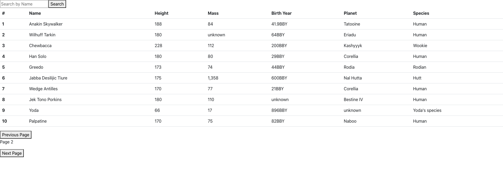

Star Wars API Application (React)

A Star Wars API application written in React and styled with Bootstrap.

Try it out <a href=https://afternoon-sea-24753.herokuapp.com>here</a>.

<b>Summary</b>

The user can browse through all the characters in the Star Wars universe listed at swapi.dev to see their height, mass, birth year, planet, and species.  In addition, the user can search for their favorite character by name instead of clicking through the pages to find them.

This Star Wars API application is my second project coding in React and my first time fetching API data and using async/await.  Although I struggled quite a bit learning to correctly access the API data and how to render it properly in the table, I've learned a lot through the process and have gotten a lot more confident about programming in React using state and hooks.  I'm looking forward to improving my skills and competency in the next project.

<b>Author</b>
<ul><b>Andy Wang</b> - <i>Full-Stack Software Developer - </i><a href=https://www.linkedin.com/in/andy-wang-wreckcreation>LinkedIn</a> - <a href=https://www.wreckcreation.net> Website </a>